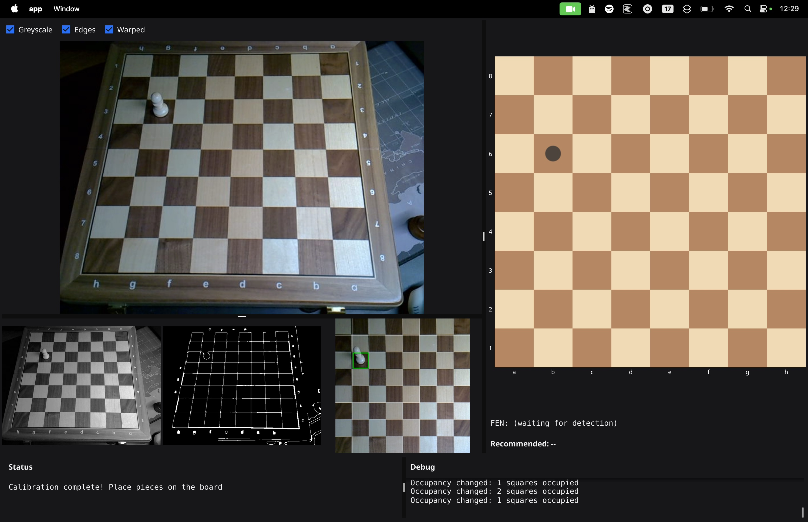

# Nayan

> *Nayan* means "vision" in Hindi

A chess companion that uses a webcam mounted above a physical chessboard to detect the board and pieces via OpenCV, then recommends moves using a local Stockfish engine. Built with Go as a learning exercise for GoCV/OpenCV.



## Features

- **Board detection** — Detects board corners via edge/contour detection with smoothing, perspective-warps to a top-down 800x800 view
- **Piece detection** — Auto-calibrates on an empty board, then detects occupied vs empty squares using pixel differencing
- **Live UI** — Side-by-side Fyne layout showing the webcam feed (with corner markers), warped board (with occupancy overlays), and a text occupancy grid

### Roadmap

- [ ] Piece recognition — identify piece types (possibly MobileNet or chess-specific model)
- [ ] Stockfish integration — pass FEN to local Stockfish binary, display recommended moves
- [ ] Virtual chessboard with piece icons, move history, and analysis panel

## Prerequisites

- **Go** 1.21+
- **OpenCV** — required for GoCV to compile
  ```bash
  # macOS
  brew install opencv
  ```
- **Webcam** — mounted above the board looking down

## Build & Run

```bash
# Build
go build -v ./...

# Run
go run ./cmd/app/main.go

# Test
go test -v ./...
```

## How It Works

1. The app opens a webcam feed and looks for the chessboard using edge detection and contour analysis
2. Once four stable corners are found, the board region is perspective-warped to a flat 800x800 image
3. After 3 seconds of stable detection, the current (empty) board is captured as a calibration reference
4. Each subsequent frame is compared square-by-square against the reference — squares with >5% pixel change are marked as occupied
5. Occupied squares are highlighted with green rectangles on the warped view, and a text grid is displayed in the UI

## Project Structure

```
cmd/app/main.go       Entry point — camera, vision pipeline, UI, calibration
pkg/camera/           VideoStream wrapping GoCV's VideoCapture (640x480)
pkg/vision/
  processor.go        Preprocessing, board contour detection, perspective warp, grid drawing
  squares.go          Square extraction, occupancy detection, board scanning
  geometry.go         Euclidean distance helper
pkg/ui/
  video.go            Custom Fyne widget for thread-safe video frame display
```

## Dependencies

- [GoCV](https://gocv.io/) — OpenCV bindings for Go
- [Fyne](https://fyne.io/) — Cross-platform GUI toolkit
- [Stockfish](https://stockfishchess.org/) — (planned) Chess engine for move recommendations

## License

MIT
